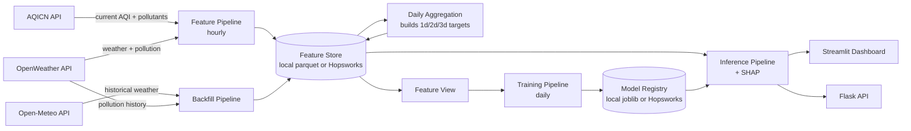

# Pearls AQI Predictor — Project Report

**City:** Islamabad, Pakistan
**Goal:** forecast Air Quality Index (AQI) for the next 3 days, on a 100% serverless stack.

This report documents what was built, why it was built that way, and how it maps back to the
project brief (feature pipeline → backfill → training pipeline → automation → web app, plus the
EDA / explainability / alerting guidelines).

---

## 1. System architecture

Every "feature store" and "model registry" call goes through a small interface with two
interchangeable backends: local parquet files (default, zero account needed) or Hopsworks (flip
`USE_HOPSWORKS=true` in `.env`). This let the whole system get built and validated before any
managed-service account existed, per the brief's "Hopsworks or Vertex AI (free tiers)" note.
Hopsworks was chosen over Vertex AI since it has a genuinely free tier with no cloud billing
account required. The deployed version of this project runs against Hopsworks for real, not just
as a fallback option: two years of Islamabad feature data live there, and training reads that
data through an actual Hopsworks Feature View rather than pulling the feature group directly.
That's worth calling out because it's the detail that's easy to skip. A feature group is just a
table; a feature view is what declares "this is what a specific model actually trains on, these
are the labels" on top of it, and it's the layer that makes the feature store usable as something
more than a fancy database. Skipping it and reading the feature group directly still works, but
it's not really following the pattern the brief is pointing at.

## 2. Data sources

| Source | Used for | Why |
|---|---|---|
| **AQICN** (`api.waqi.info`) | Live, ground-truth AQI (US EPA 0-500 scale) + pollutant sub-indices | Purpose-built AQI index, official government monitoring stations (Islamabad: US Embassy monitor) |
| **OpenWeather** | Current + forecast weather; current + *historical* pollutant concentrations | Only free source found with both weather and historical air-pollution data |
| **Open-Meteo** (`archive-api.open-meteo.com`) | Historical weather, no API key required | OpenWeather's free tier has no historical *weather* endpoint (only historical pollution); this closes that gap for backfill |

Using a third free source beyond the brief's suggested AQICN/OpenWeather pair was a deliberate
call: the brief explicitly says *"the above API is just an example, you may need to explore
other options too"*, and without it, backfilled training rows would have no weather features at
all.

## 3. Feature pipeline (hourly)

`src/pipelines/feature_pipeline.py` runs every hour via GitHub Actions:
1. Fetches the current AQI + pollutant sub-indices from AQICN.
2. Fetches current weather + pollution from OpenWeather.
3. Merges into one row, keyed by timestamp, and upserts it into the `aqi_raw_hourly` feature group.

Time-based features, built in `src/features/feature_engineering.py`, include hour, day, month,
day-of-week, and a weekend flag, plus cyclical `sin`/`cos` encodings of hour and month so models
see time as periodic rather than a discontinuous integer jump (hour 23 to hour 0). Derived
features include the AQI change rate (hour-over-hour and day-over-day), rolling means (3h/24h at
hourly grain, 3d/7d at daily grain), and 1/2/3-day AQI lag features.

**Forecast targets are joined by calendar date, not row position.** Early on, targets were built
with a plain `.shift(-h)`: "the value h rows ahead." That's wrong the moment a day is missing
from the data (an outage, a gap in the hourly pipeline): shifting by rows would quietly pair day
4 with day 6's value and call it "2 days ahead" when it's actually 2 days from a day that isn't
day 4 at all. The fix was to look up `date + h days` explicitly and let a missing date resolve to
`NaN` rather than to the wrong neighbor. It's a small thing, but it's the kind of bug that
doesn't show up in a spot check; it just quietly makes the training data slightly wrong.

## 4. Historical backfill

`src/pipelines/backfill_pipeline.py` pulls historical pollutant concentrations from OpenWeather
and historical weather from Open-Meteo, for a configurable number of past days (default 730,
i.e. 2 years). OpenWeather's historical pollution data goes back to Nov 27, 2020, so there's far
more available than the project needs. An early version of this pipeline defaulted to 90 days,
which produced too few training rows for a stable train/test split and negative R² on every
horizon. Increasing the backfill window was the direct fix, and it worked (see the results
below).

AQICN's free tier has no bulk-historical endpoint, so backfilled AQI values are not AQICN's real
reading. They're reconstructed from OpenWeather's historical PM2.5/PM10 concentrations using the
standard EPA breakpoint formula (`src/features/aqi_calculator.py`), taking the worse of the two
pollutant sub-indices per EPA's "AQI = worst pollutant" methodology, with pollutant
concentrations truncated (not rounded) to the precision EPA's own tables specify before the
breakpoint lookup. This only considers PM2.5/PM10 (not O3/NO2/SO2/CO, whose EPA breakpoints are
defined in ppb/ppm and need temperature/pressure-dependent unit conversion). Live rows collected
by the hourly pipeline use AQICN's real, full AQI directly and are strictly more trustworthy. The
backfill exists purely to bootstrap enough training history to not have to wait weeks for a first
model; as more real hourly data accumulates, its share of the training set grows automatically.

## 5. Training pipeline

`src/pipelines/training_pipeline.py` runs daily. For each forecast horizon (1, 2, 3 days out):

1. Pulls training data through the Feature View described in §1.
2. Time-ordered train/test split, not random. Shuffling a time series leaks future information
   into training.
3. Trains four candidate models:

   | Model | Category | Notes |
   |---|---|---|
   | **Persistence baseline** | Statistical (naive) | "Tomorrow's AQI = today's AQI." Zero parameters, no training. The benchmark every other model must beat. |
   | **Ridge Regression** | Statistical (linear) | `scikit-learn`, standardized features |
   | **Random Forest** | Statistical (ensemble) | `scikit-learn`, 300 trees, depth-capped |
   | **TensorFlow MLP** | Deep learning | 2 hidden layers (32→16 units), dropout, early stopping |

   This spread, naive baseline through linear/ensemble methods to a neural network, is the
   "variety of forecasting models, from statistical modelling to deep learning" called for in the
   brief.
4. Evaluates each with RMSE, MAE, and R² on the held-out (most recent) rows.
5. Registers whichever model scored lowest RMSE as that horizon's production model, via the model
   registry abstraction (local joblib+JSON, or Hopsworks Model Registry). Saved models carry a
   SHA-256 checksum, checked again at load time as cheap insurance against a corrupted or
   tampered artifact silently getting loaded into production.

One caveat on TensorFlow: the target machine's Python version may not have a TensorFlow build
available yet (true as of this project's development; Python 3.14 had no TensorFlow wheel).
Training treats this as non-fatal: the MLP branch is skipped with a logged warning, and the
Ridge/Random Forest/baseline comparison still runs and a model still gets deployed. Install
TensorFlow separately (`pip install tensorflow`) on a compatible Python version to include the
deep learning branch in the comparison.

### Results

Evaluated on the held-out test split (the most recent 20% of rows, in time order) across 725
backfilled daily records.

| Horizon | Deployed model | RMSE | MAE | R² | Trained at (UTC) |
|---|---|---|---|---|---|
| 1d | Random Forest | 18.87 | 14.46 | 0.714 | 2026-08-28T18:59:49Z |
| 2d | Random Forest | 26.21 | 21.69 | 0.449 | 2026-08-28T18:59:49Z |
| 3d | Ridge | 26.58 | 22.66 | 0.430 | 2026-08-28T18:59:49Z |

Full candidate comparison, all four models per horizon:

| Horizon | Model | RMSE | MAE | R² |
|---|---|---|---|---|
| 1d | Persistence baseline | 20.52 | 15.40 | 0.662 |
| 1d | Ridge | 19.57 | 14.84 | 0.693 |
| 1d | **Random Forest (deployed)** | **18.87** | **14.46** | **0.714** |
| 1d | TensorFlow MLP | 22.35 | 18.43 | 0.599 |
| 2d | Persistence baseline | 27.87 | 21.94 | 0.377 |
| 2d | Ridge | 26.35 | 21.89 | 0.443 |
| 2d | **Random Forest (deployed)** | **26.21** | **21.69** | **0.449** |
| 2d | TensorFlow MLP | 27.08 | 22.42 | 0.411 |
| 3d | Persistence baseline | 30.87 | 24.56 | 0.231 |
| 3d | Random Forest | 28.63 | 24.34 | 0.339 |
| 3d | **Ridge (deployed)** | **26.58** | **22.66** | **0.430** |
| 3d | TensorFlow MLP | 30.55 | 25.79 | 0.247 |

Every deployed model beats the persistence baseline at every horizon, which is the first thing
worth checking and the easiest thing to get wrong. It's entirely possible to train a model that
looks reasonable in isolation but doesn't actually add anything over "assume tomorrow looks like
today." That's not the case here: even at 3 days out, where the naive baseline holds up
surprisingly well (R² 0.231, better than either Random Forest or the MLP at that horizon), Ridge
still improves on it by a real margin.

The more interesting pattern is which model wins where. Random Forest takes the 1-day and 2-day
horizons; Ridge takes 3-day. That's consistent with what the input features actually capture:
the lag and rolling-mean features (yesterday's AQI, the 3-day and 7-day rolling averages) carry
most of the real signal for near-term forecasting, and a tree ensemble is good at picking out
which combination of recent readings to weight. But that signal degrades as the horizon
stretches out, and by 3 days the weather and pollutant features are doing more of the work than
the AQI history is. A linear model handles that flatter, noisier relationship better than a
forest that's prone to overfitting on training-set-specific interactions once the target's
harder to pin down. The TensorFlow MLP trails at every horizon, which tracks: 725 rows is not a
lot of data for a neural network with two hidden layers to learn from, and the simpler models
were never at a disadvantage here.

Expanding the backfill window from 90 days to 730 was the change that mattered most. The earlier,
shorter window produced negative R² across every horizon, not a training bug, just not enough
rows for a meaningful time-ordered train/test split. More history didn't just add data; it's
what turned "the model doesn't work" into "the model beats a naive baseline by a real margin."

## 6. Automation (CI/CD)

Two GitHub Actions workflows (`.github/workflows/`):
- **`feature_pipeline.yml`**: cron `5 * * * *` (hourly), also triggerable manually.
- **`training_pipeline.yml`**: cron `30 2 * * *` (daily), runs daily aggregation then training.

GitHub Actions was chosen over Apache Airflow (the brief's other suggested option) because it
needs no separately-hosted scheduler/webserver. The repo itself is the only infrastructure, which
fits the "100% serverless" framing of the project.

While `USE_HOPSWORKS=false`, both workflows commit the updated local feature store / model
registry files back into the repo after each run, since GitHub Actions runners start from a
clean checkout every time and would otherwise "forget" all prior runs. With Hopsworks enabled
(the actual deployed setup), that step is unnecessary, since the feature store and model registry
both persist state on their own.

## 7. Web application

- **Streamlit dashboard** (`dashboard/app.py`): primary UI. Current AQI + 3-day forecast cards
  (color-coded by EPA category), a trend chart (observed history + forecast, with the alert
  threshold marked), a model comparison tab (the table in §5, rendered live), an SHAP
  explainability tab (per-horizon feature contribution bar chart), and an EDA tab (AQI
  distribution, AQI-vs-weather scatterplots with OLS trendlines, feature correlation heatmap).
  Nothing runs until the user clicks "Generate Forecast": SHAP computation takes up to ~30
  seconds, so it shouldn't fire silently on every page load.
- **Flask API** (`api/app.py`, `master` branch only): `/health`, `/history`, and `/forecast`
  (`/predict` alias), returning the same data the dashboard shows as JSON. Built specifically to
  cover Flask as a named required technology beyond just Streamlit, and to make the forecast
  consumable outside the dashboard.

**Two deployment branches, not one config flag.** The repo splits into `master` (two-tier: the
Flask API above, deployed as its own service, with the dashboard calling it over HTTP) and
`streamlit-only-deployment` (single-tier: the dashboard runs inference in-process, no separate
API at all). Both are fully built and tested. The live app, at
https://islamabad-aqipredictor.streamlit.app/, runs the single-tier `streamlit-only-deployment`
branch; `master`'s Flask API is built and tested but not deployed to Render yet. The split
exists because an earlier single-codebase version toggled between the two modes on an `API_URL`
config flag. That worked, but it left Flask code, `render.yaml`, and an HTTP client sitting
unused on whichever deployment never touched them. Two real branches make each one a minimal
reflection of the architecture it actually runs, with everything upstream of the web layer
(feature pipeline through SHAP) identical on both. See `README.md`'s "Two deployment branches"
section for the full reasoning and the deploy steps for each.

On `master`, `api/app.py` is built to deploy via the included `render.yaml` blueprint on
[Render](https://render.com), an always-on process with no execution-time limit, which fits
`gunicorn` and `/forecast`'s ~20-second live SHAP computation cleanly. A stricter-timeout
serverless host like Vercel's free tier would time out on that call most of the time, which is
why Render, not Vercel, backs this branch. On `streamlit-only-deployment`, there's nothing to
host beyond the Streamlit app itself.

## 8. Security & robustness

A handful of hardening passes worth documenting on their own, since none of this was strictly
required by the brief but all of it came out of actually trying to run the thing against a real
network and real data:

- **API auth**: `/forecast` and `/history` accept an optional `API_AUTH_TOKEN`, checked with
  `hmac.compare_digest` rather than a plain string comparison, which avoids timing attacks that a
  naive `==` check is vulnerable to. Off by default for local use; worth turning on before
  exposing the API anywhere public.
- **Rate limiting**: a simple cooldown on `/forecast`, since every call triggers real Hopsworks
  reads and (in local-fallback mode) SHAP computation. Cheap to add, and it stops an accidental
  refresh loop from hammering the feature store.
- **No leaked internals**: API clients (AQICN, OpenWeather) catch and re-raise request failures
  as sanitized errors instead of letting the raw exception (which can contain the API key as a
  query parameter) bubble up to a log or an error banner. The Flask API's global exception
  handler does the same for anything unexpected: a generic message to the client, the real
  traceback only in the server-side log.
- **Model integrity**: SHA-256 checksums on saved models, verified again before load (§5).
- **Backfill bounded**: `--days` is capped by `MAX_BACKFILL_DAYS` so a typo or a bad automation
  trigger can't accidentally request years of API calls in one run.

## 9. Explainability (SHAP)

`src/models/explain.py` computes SHAP values for whichever model was deployed for a given
horizon: `TreeExplainer` for Random Forest (fast, exact), and the model-agnostic `Explainer` for
Ridge/persistence/the MLP (works uniformly across model types, slower; this is also the reason
`/forecast` is too slow for a serverless free tier as-is, see §7). The dashboard's explainability
tab shows the top contributing features, with sign, for the currently-deployed prediction at each
horizon.

## 10. Hazard alerting

`src/utils/alerts.py` checks the current AQI and each forecasted horizon against
`AQI_ALERT_THRESHOLD` (default 150, EPA's "Unhealthy for Sensitive Groups" boundary). The
dashboard surfaces a banner naming exactly which day(s) breach the threshold when any do, and the
threshold itself is adjustable live from the sidebar without needing to regenerate a forecast.

## 11. Testing

`tests/` covers the pure-function modules (no API calls, safe to run anywhere): the EPA AQI
breakpoint calculator, the feature engineering functions (time features, daily aggregation,
forecast target alignment), and the Flask API's routes.

Beyond unit tests, the full pipeline (daily aggregation → training → inference → SHAP) was
smoke-tested end to end against synthetic seasonal+weekly AQI data before being run against real
Islamabad data, specifically to catch integration issues independent of live API availability or
rate limits. That approach is what caught two real bugs before they reached production data: a
SHAP background-sample NaN-handling failure, and the row-position-vs-calendar-date forecast
target bug described in §3. The second one was only visible once a synthetic test deliberately
dropped a day from the data and checked that the resulting target came back `NaN` instead of
silently pointing at the wrong day.

## 12. Known limitations / possible future work

- **Backfilled AQI is an estimate**, not AQICN ground truth (see §4). Its share of the training
  set shrinks automatically as more real hourly data accumulates.
- **No PyTorch branch**: the brief lists "TensorFlow/PyTorch." TensorFlow was implemented, not
  both, to avoid duplicating the same deep-learning comparison twice.
- **No Vertex AI backend**: Hopsworks was chosen (see §1). The feature store/model registry
  interface is abstracted specifically so a Vertex AI backend could be added later without
  touching pipeline code.
- **Recursive multi-step forecasting was not used**: each horizon (1d/2d/3d) is a separately
  trained "direct" model rather than a single model forecasting step-by-step. This avoids
  compounding one-step errors across the 3-day window, at the cost of training 3x the models.
- **`/forecast` computes SHAP live, which bounds how it can be hosted**: on `master`, that's why
  the Flask API deploys to Render (no execution-time limit) rather than a stricter-timeout
  serverless host. Precomputing SHAP during the daily training run instead of on every request
  is the fix if a tighter time budget ever matters; not yet built.
- **The single-tier branch (`streamlit-only-deployment`) has no separately-hosted API at all.**
  This is by design, not a limitation to fix. See §7 and `README.md` for why both exist.

## 13. How to run this

See `README.md` for full setup, local run, and deployment instructions.
