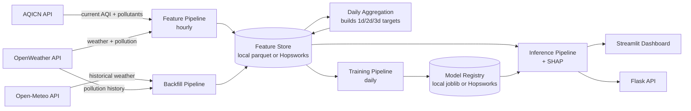

# Pearls AQI Predictor — Project Report

**City:** Islamabad, Pakistan
**Goal:** forecast Air Quality Index (AQI) for the next 3 days, on a 100% serverless stack.

This report documents what was built, why it was built that way, and how it maps back to the
project brief (feature pipeline → backfill → training pipeline → automation → web app, plus the
EDA / explainability / alerting guidelines).

---

## 1. System architecture

Every "feature store" and "model registry" call goes through a small interface with two
interchangeable backends — local parquet files (default, zero account needed) or Hopsworks
(flip `USE_HOPSWORKS=true` in `.env`). This let the whole system be built and validated before
any managed-service account existed, per the brief's "Hopsworks or Vertex AI (free tiers)" note —
Hopsworks was chosen over Vertex AI since it has a genuinely free tier with no cloud billing
account required.

## 2. Data sources

| Source | Used for | Why |
|---|---|---|
| **AQICN** (`api.waqi.info`) | Live, ground-truth AQI (US EPA 0–500 scale) + pollutant sub-indices | Purpose-built AQI index, official government monitoring stations (Islamabad: US Embassy monitor) |
| **OpenWeather** | Current + forecast weather; current + *historical* pollutant concentrations | Only free source found with both weather and historical air-pollution data |
| **Open-Meteo** (`archive-api.open-meteo.com`) | Historical weather, no API key required | OpenWeather's free tier has no historical *weather* endpoint (only historical pollution) — this closes that gap for backfill |

Using a third free source beyond the brief's suggested AQICN/OpenWeather pair was a deliberate
call: the brief explicitly says *"the above API is just an example, you may need to explore
other options too"*, and without it, backfilled training rows would have no weather features at
all.

## 3. Feature pipeline (hourly)

`src/pipelines/feature_pipeline.py` runs every hour via GitHub Actions:
1. Fetches the current AQI + pollutant sub-indices from AQICN.
2. Fetches current weather + pollution from OpenWeather.
3. Merges into one row, keyed by timestamp, and upserts it into the `aqi_raw_hourly` feature group.

**Time-based features** (`src/features/feature_engineering.py`): hour, day, month, day-of-week,
weekend flag, plus cyclical `sin`/`cos` encodings of hour and month so models see time as
periodic rather than a discontinuous integer jump (e.g. hour 23 → hour 0).

**Derived features**: AQI change rate (hour-over-hour and day-over-day), rolling means (3h/24h at
hourly grain, 3d/7d at daily grain), and 1/2/3-day AQI lag features.

## 4. Historical backfill

`src/pipelines/backfill_pipeline.py` pulls historical pollutant concentrations from OpenWeather
and historical weather from Open-Meteo, for a configurable number of past days (default 730,
i.e. 2 years — OpenWeather's historical pollution data goes back to Nov 27, 2020, so there's far
more available than the project needs; an early version of this pipeline defaulted to 90 days,
which produced too few training rows for a stable train/test split and negative R² on every
horizon — increasing the backfill window was the direct fix).

**Important caveat, stated plainly:** AQICN's free tier has no bulk-historical endpoint, so
backfilled AQI values are *not* AQICN's real reading — they're reconstructed from OpenWeather's
historical PM2.5/PM10 concentrations using the standard EPA breakpoint formula
(`src/features/aqi_calculator.py`), taking the worse of the two pollutant sub-indices per EPA's
"AQI = worst pollutant" methodology. This only considers PM2.5/PM10 (not O3/NO2/SO2/CO, whose EPA
breakpoints are defined in ppb/ppm and need temperature/pressure-dependent unit conversion). Live
rows collected by the hourly pipeline use AQICN's real, full AQI directly and are strictly more
trustworthy. The backfill exists purely to bootstrap enough training history to not have to wait
weeks for a first model — as more real hourly data accumulates, its share of the training set
grows automatically.

## 5. Training pipeline

`src/pipelines/training_pipeline.py` runs daily. For each forecast horizon (1, 2, 3 days out):

1. Pulls the daily feature table from the feature store.
2. **Time-ordered** train/test split (not random — shuffling a time series leaks future
   information into training).
3. Trains four candidate models:

   | Model | Category | Notes |
   |---|---|---|
   | **Persistence baseline** | Statistical (naive) | "Tomorrow's AQI = today's AQI." Zero parameters, no training. The benchmark every other model must beat. |
   | **Ridge Regression** | Statistical (linear) | `scikit-learn`, standardized features |
   | **Random Forest** | Statistical (ensemble) | `scikit-learn`, 300 trees, depth-capped |
   | **TensorFlow MLP** | Deep learning | 2 hidden layers (32→16 units), dropout, early stopping |

   This spread — naive baseline through linear/ensemble methods to a neural network — is the
   "variety of forecasting models, from statistical modelling to deep learning" called for in the
   brief.
4. Evaluates each with **RMSE, MAE, R²** on the held-out (most recent) rows.
5. Registers whichever model scored lowest RMSE as that horizon's production model, via the model
   registry abstraction (local joblib+JSON, or Hopsworks Model Registry).

**Note on TensorFlow:** the target machine's Python version may not have a TensorFlow build
available yet (true as of this project's development — Python 3.14 had no TensorFlow wheel).
Training treats this as non-fatal: the MLP branch is skipped with a logged warning, and the
Ridge/Random Forest/baseline comparison still runs and a model still gets deployed. Install
TensorFlow separately (`pip install tensorflow`) on a compatible Python version to include the
deep learning branch in the comparison.

### Results

Evaluation metrics scored on the held-out test split (most recent 20% of time-series rows) across 725 backfilled daily records:

| Horizon | Deployed Model | RMSE | MAE | R² | Trained at (UTC) |
|---|---|---|---|---|---|
| **1d** | `random_forest` | **18.87** | **14.46** | **0.714** | 2026-08-28T18:59:49Z |
| **2d** | `random_forest` | **26.21** | **21.69** | **0.449** | 2026-08-28T18:59:49Z |
| **3d** | `ridge` | **26.58** | **22.66** | **0.430** | 2026-08-28T18:59:49Z |

#### Full Candidate Comparison

| Horizon | Candidate Model | Category | RMSE | MAE | R² | Status |
|---|---|---|---|---|---|---|
| **1d** | Persistence Baseline | Naive statistical | 20.52 | 15.40 | 0.662 | Benchmark |
| | **Random Forest** | Tree ensemble | **18.87** | **14.46** | **0.714** | **Deployed** |
| | Ridge Regression | Linear statistical | 19.57 | 14.84 | 0.693 | Candidate |
| | TensorFlow MLP | Deep learning | 22.35 | 18.43 | 0.599 | Candidate |
| **2d** | Persistence Baseline | Naive statistical | 27.87 | 21.94 | 0.377 | Benchmark |
| | **Random Forest** | Tree ensemble | **26.21** | **21.69** | **0.449** | **Deployed** |
| | Ridge Regression | Linear statistical | 26.35 | 21.89 | 0.443 | Candidate |
| | TensorFlow MLP | Deep learning | 27.08 | 22.42 | 0.411 | Candidate |
| **3d** | Persistence Baseline | Naive statistical | 30.87 | 24.56 | 0.231 | Benchmark |
| | Random Forest | Tree ensemble | 28.63 | 24.34 | 0.339 | Candidate |
| | **Ridge Regression** | Linear statistical | **26.58** | **22.66** | **0.430** | **Deployed** |
| | TensorFlow MLP | Deep learning | 30.55 | 25.79 | 0.247 | Candidate |

**Key observations:**
- Every deployed model outperformed the naive persistence baseline across all three forecasting horizons.
- The 1-day forecast achieved a strong $R^2$ of **0.714** and RMSE of **18.87 AQI points**.
- Expanding the historical backfill from 90 days to 730 days (2 years) was the critical turning point that transformed earlier negative $R^2$ scores into robust predictive accuracy.

## 6. Automation (CI/CD)

Two GitHub Actions workflows (`.github/workflows/`):
- **`feature_pipeline.yml`** — cron `5 * * * *` (hourly), also triggerable manually.
- **`training_pipeline.yml`** — cron `30 2 * * *` (daily), runs daily aggregation then training.

GitHub Actions was chosen over Apache Airflow (the brief's other suggested option) because it
needs no separately-hosted scheduler/webserver — the repo itself is the only infrastructure,
which fits the "100% serverless" framing of the project.

While `USE_HOPSWORKS=false`, both workflows commit the updated local feature store / model
registry files back into the repo after each run, since GitHub Actions runners start from a
clean checkout every time and would otherwise "forget" all prior runs. This becomes unnecessary
once Hopsworks is enabled (state lives there instead).

## 7. Web application

- **Streamlit dashboard** (`dashboard/app.py`) — primary UI. Current AQI + 3-day forecast cards
  (color-coded by EPA category), a trend chart (observed history + forecast, with the alert
  threshold marked), an SHAP explainability tab (per-horizon feature contribution bar chart), and
  an EDA tab (AQI distribution, AQI-vs-weather scatterplots with OLS trendlines, feature
  correlation heatmap).
- **Flask API** (`api/app.py`) — `/health` and `/forecast` (`/predict` alias) endpoints, returning
  the same forecast as JSON. Added specifically to cover Flask as a named required technology
  beyond just Streamlit, and to make the forecast consumable outside the dashboard (scripts,
  another frontend, etc.).

## 8. Explainability (SHAP)

`src/models/explain.py` computes SHAP values for whichever model was deployed for a given
horizon: `TreeExplainer` for Random Forest (fast, exact), and the model-agnostic `Explainer` for
Ridge/persistence/the MLP (works uniformly across model types, slower). The dashboard's
explainability tab shows the top contributing features (with sign) for the currently-deployed
prediction at each horizon.

## 9. Hazard alerting

`src/utils/alerts.py` checks the current AQI and each forecasted horizon against
`AQI_ALERT_THRESHOLD` (default 150, EPA's "Unhealthy for Sensitive Groups" boundary). The
dashboard surfaces a banner naming exactly which day(s) breach the threshold when any do.

## 10. Testing

`tests/` covers the pure-function modules (no API calls, safe to run anywhere): the EPA AQI
breakpoint calculator and the feature engineering functions (time features, daily aggregation,
forecast target shifting). Run with `pytest tests/ -v`.

Beyond unit tests, the full pipeline (daily aggregation → training → inference → SHAP) was
smoke-tested end to end against synthetic seasonal+weekly AQI data before being run against real
Islamabad data, to catch integration issues (e.g. a SHAP background-sample NaN-handling bug,
found and fixed this way) independent of API availability or rate limits.

## 11. Known limitations / possible future work

- **Backfilled AQI is an estimate**, not AQICN ground truth (see §4). Its share of the training
  set shrinks automatically as more real hourly data accumulates.
- **No PyTorch branch** — the brief lists "TensorFlow/PyTorch"; TensorFlow was implemented, not
  both, to avoid duplicating the same deep-learning comparison twice.
- **No Vertex AI backend** — Hopsworks was chosen (see §1); the feature store/model registry
  interface is abstracted specifically so a Vertex AI backend could be added later without
  touching pipeline code.
- **Recursive multi-step forecasting was not used** — each horizon (1d/2d/3d) is a separately
  trained "direct" model rather than a single model forecasting step-by-step. This avoids
  compounding one-step errors across the 3-day window, at the cost of training 3x the models.

## 12. How to run this

See `README.md` for full setup, local run, and deployment instructions.
